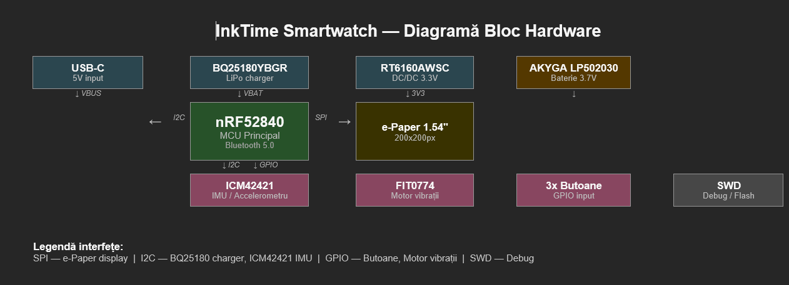

# InkTime - Open Source Smartwatch

InkTime este un smartwatch open source și accesibil, bazat pe un display e-paper și microcontroller-ul nRF52840.


## Diagramă bloc

```
┌─────────────┐     ┌─────────────────────────────────────────────────┐
│  USB-C      │─5V─▶│                                                 │
└─────────────┘     │                                                 │
                    │  BQ25180YBGR (LiPo Charger)                    │
┌─────────────┐     │         │ VBAT                                  │
│ AKYGA       │────▶│         ▼                                       │
│ LP502030    │     │  RT6160AWSC (DC/DC) ──▶ 3.3V                   │
│ 3.7V 250mAh │     └─────────────────────────────────────────────────┘
└─────────────┘                    │ 3V3
                                   ▼
                    ┌──────────────────────────────┐
                    │         nRF52840              │
                    │      MCU Principal            │
                    │      Bluetooth 5.0            │
                    └──────────────────────────────┘
                         │        │        │        │
                       SPI       I2C     GPIO      SWD
                         │        │        │        │
                    ┌────┘   ┌───┘    ┌───┘    ┌───┘
                    ▼        ▼        ▼        ▼
              e-Paper    ICM42421  FIT0774   Debug
              1.54"      IMU      Vibrații   SWD
              200x200               +
                                  3x Butoane
```

---

## BOM (Bill of Materials)

| Referinta   | Componenta      | Model                  | Cantitate | Link achizitie                                                                  | Datasheet                                                                                                      |
| ----------- | --------------- | ---------------------- | --------- | ------------------------------------------------------------------------------- | -------------------------------------------------------------------------------------------------------------- |
| U1          | MCU             | nRF52840               | 1         | [JLC](https://jlcpcb.com/partdetail/NordicSemiconductor-nRF52840_QIAA/C190794) | [Datasheet](https://4donline.ihs.com/images/VipMasterIC/IC/NRSA/NRSA-S-A0021008244/NRSA-S-A0021008244-1.pdf?hkey=61A2E4C270F0397D049F8F05BD4F1054)  |
| IC1         | LiPo Charger    | BQ25180YBGR            | 1         | [JLC](https://componentsearchengine.com/prices/BQ25180YBGR?manufacturer=Texas%20Instruments)     | [Datasheet](https://www.ti.com/lit/ds/symlink/bq25180.pdf)                                                     |
| IC2         | Haptic Driver   | DRV2605YZFR            | 1         | [JLC](https://componentsearchengine.com/prices/DRV2605YZFR?manufacturer=Texas%20Instruments)     | [Datasheet](https://www.ti.com/lit/ds/symlink/drv2605.pdf)                                                     |
| IC3         | IMU             | BMA423                 | 1         | [JLC](https://componentsearchengine.com/prices/BMA423?manufacturer=BOSCH)                      | [Datasheet](https://4donline.ihs.com/images/VipMasterIC/IC/BSCH/BSCH-S-A0007921771/BSCH-S-A0010021471-1.pdf?hkey=61A2E4C270F0397D049F8F05BD4F1054)    |
| IC9         | DC/DC Converter | RT6160AWSC             | 1         | [JLC](https://componentsearchengine.com/prices/RT6160AWSC?manufacturer=RICHTEK)               | [Datasheet](https://4donline.ihs.com/images/VipMasterIC/IC/RHTK/RHTK-S-A0025617216/RHTK-S-A0025617221-1.pdf?hkey=61A2E4C270F0397D049F8F05BD4F1054)                                |
| U3          | Fuel Gauge      | MAX17048G+T10          | 1         | [JLC](https://componentsearchengine.com/prices/MAX17048G%2BT10?manufacturer=Analog%20Devices)      | [Datasheet](https://4donline.ihs.com/images/VipMasterIC/IC/RHTK/RHTK-S-A0025617216/RHTK-S-A0025617221-1.pdf?hkey=61A2E4C270F0397D049F8F05BD4F1054)         |
| D3          | ESD Protection  | USBLC6-2SC6Y           | 1         | [JLC](https://componentsearchengine.com/prices/USBLC6-2SC6Y?manufacturer=STMicroelectronics)   | [Datasheet](https://www.analog.com/media/en/technical-documentation/data-sheets/MAX17048-MAX17049.pdf?ADICID=SYND_WW_P682800_PF-spglobal)                                             |
| J4          | USB-C Connector | KH-TYPE-C-16P          | 1         | [JLC](https://www.snapeda.com/parts/KH-TYPE-C-16P/kinghelm/view-part/?ref=search&t=KH-TYPE-C-16P&ab_test_case=b)                    | [Datasheet](https://www.snapeda.com/parts/KH-TYPE-C-16P/kinghelm/datasheet/)        |
| J1          | E-Paper Connector | 503480-2400E         | 1         | [JLC](https://componentsearchengine.com/prices/5034802400?manufacturer=Molex)                 | [Datasheet](https://4donline.ihs.com/images/VipMasterIC/IC/MOLE/MOLE-S-A0003522481/MOLE-S-A0010982248-1.pdf?hkey=61A2E4C270F0397D049F8F05BD4F1054)                                      |
| ANT1        | Antena BLE      | 2450AT18B100E          | 1         | [JLC](https://componentsearchengine.com/prices/2450AT18B100E?manufacturer=JOHANSON%20TECHNOLOGY)             | [Datasheet](https://www.johansontechnology.com/docs/1187/2450AT18B100_X8XXogU.pdf)                     |
| X1          | Crystal 32MHz   | SMD 2016               | 1         | [JLC](https://componentsearchengine.com/prices/SMD2016B050TF?manufacturer=Yageo%20Group)                   | [Datasheet](https://4donline.ihs.com/images/VipMasterIC/IC/YAGO/YAGO-S-A0024580626/YAGO-S-A0024591343-1.pdf?hkey=61A2E4C270F0397D049F8F05BD4F1054)                            |
| X2          | Crystal 32.768kHz | SMD 2016             | 1         | [JLC](https://componentsearchengine.com/prices/SMD2016B050TF?manufacturer=Yageo%20Group)               | [Datasheet](https://4donline.ihs.com/images/VipMasterIC/IC/YAGO/YAGO-S-A0024580626/YAGO-S-A0024591343-1.pdf?hkey=61A2E4C270F0397D049F8F05BD4F1054)                               |
| SW1-3       | Buton tactil    | EVP-AKE31A             | 3         | [JLC](https://componentsearchengine.com/prices/EVP-AKE31A?manufacturer=Panasonic)               | [Datasheet](https://industrial.panasonic.com/cdbs/www-data/pdf/ATK0000/ATK0000C434.pdf)                        |
| J2          | SWD Connector   | TC2030-IDC             | 1         | [JLC](https://componentsearchengine.com/prices/TC2030-IDC?manufacturer=Tag%20Connect)             | [Datasheet](https://4donline.ihs.com/images/VipMasterIC/IC/TGCN/TGCN-S-A0008988129/TGCN-S-A0008988129-1.pdf?hkey=61A2E4C270F0397D049F8F05BD4F1054)                   |
| Q2          | MOSFET P-ch     | DMG2305UX-7            | 1         | [JLC](https://componentsearchengine.com/prices/DMG2305UX-7?manufacturer=Diodes%20Incorporated)                 | [Datasheet](https://4donline.ihs.com/images/VipMasterIC/IC/DIOD/DIOD-S-A0013043571/DIOD-S-A0013120650-1.pdf?hkey=61A2E4C270F0397D049F8F05BD4F1054)                                            |
| Q3          | MOSFET N-ch     | SI1308EDL-T1-GE3       | 1         | [JLC](https://componentsearchengine.com/prices/Si1308EDL-T1-GE3?manufacturer=Vishay)             | [Datasheet](https://4donline.ihs.com/images/VipMasterIC/IC/VISH/VISH-S-A0000692786/VISH-S-A0000692786-1.pdf?hkey=61A2E4C270F0397D049F8F05BD4F1054)                                                   |
| D2, D4, D5  | Dioda Schottky  | MBR0530                | 3         | [JLC](https://componentsearchengine.com/prices/MBR0530?manufacturer=MCC)           | [Datasheet](https://4donline.ihs.com/images/VipMasterIC/IC/MCCC/MCCCS04194/MCCCS04194-1.pdf?hkey=61A2E4C270F0397D049F8F05BD4F1054)                                         |
| L1          | Inductanta 0.47µH | FTC252012SR47MBCA    | 1         | [JLC](https://jlcpcb.com/partdetail/6763488-FTC252012SR47MBCA/C5832368)                 |
| L2          | Inductanta 15nH | RF matching 0201       | 1         | [JLC](https://jlcpcb.com/partdetail/Sunlord-SDCL0201C15NJTDF/C389547)          |     -                   |
| L3          | Inductanta 3.9nH | RF matching 0201      | 1         | [JLC](https://jlcpcb.com/partdetail/Sunlord-SDCL0201C3N9STDF/C389544)          |     -                   |
| L5          | Inductanta 68µH | EPD driver SMD         | 1         | [JLC](https://jlcpcb.com/partdetail/Sumida-CDMC4D28NP680MC/C408336)            |     -                       |
| L7          | Inductanta 10µH | DC/DC SMD              | 1         | [JLC](https://jlcpcb.com/partdetail/Sunlord-MWSA0402S100MT/C408352)            |     -                     |
| C*          | Condensatoare   | 100nF decuplare 0201   | multiple  | [JLC](https://jlcpcb.com/partdetail/Samsung-CL03B104KO3NNNC/C15195)            | -                                                                                                               |
| C*          | Condensatoare   | >100nF bulk 0402       | multiple  | [JLC](https://jlcpcb.com/partdetail/Samsung-CL05A475KP5NRNC/C25771)            | -                                                                                                               |
| R*          | Rezistente      | Diverse valori 0201    | multiple  | [JLC](https://jlcpcb.com/partdetail/UNI-ROYAL-0201WAF1001T5E/C17513)           | -                                                                                                               |

---

## Descriere funcționalitate hardware

### MCU — nRF52840

Microcontroller-ul principal al proiectului. Are integrat Bluetooth 5.0, suportă SPI, I2C, UART și GPIO. Rulează la 3.3V, consumă ~1.5mA activ și sub 2μA în deep sleep. Procesor ARM Cortex-M4F la 64MHz, 1MB Flash și 256KB RAM.

### Display e-Paper 1.54" (Waveshare V2)

Display electrofotoreic bistabil cu rezoluție 200×200 pixeli. Conectat prin SPI 4 fire. Consumul în deep sleep este sub 2μA. Imaginea rămâne afișată fără consum de energie (bi-stable) — ideal pentru smartwatch.

### Baterie AKYGA LP502030

Baterie Li-Po de 250mAh, 3.7V nominal. Se conectează direct la două test pad-uri de pe PCB (TP_BAT și TP_BAT_GND), fără conector JST, pentru economisirea spațiului în carcasă.

### LiPo Charger — BQ25180YBGR

Circuit de încărcare a bateriei Li-Po, conectat prin I2C la MCU. Suportă încărcare CC/CV, protecție la supraîncărcare (4.3V) și supradescărcare (2.5V). Tensiunea de intrare vine de la USB-C (VBUS 5V).

### DC/DC Converter — RT6160AWSC

Convertor buck care generează 3.3V pentru MCU și restul componentelor. Eficiență ~90%, comunicație I2C pentru configurare dinamică a tensiunii de ieșire.

### IMU — BMA423

Accelerometru 3-axis conectat prin I2C. Detectează mișcări, orientare, pași și gesture-uri. Întreruperile IMU_INT1 și IMU_INT2 sunt conectate la GPIO-uri ale MCU.

### Haptic Driver — DRV2605YZFR

Driver pentru motorul de vibrații, conectat prin I2C. Controlează FIT0774 și permite pattern-uri de vibrații complexe pentru notificări tactile diferențiate.

### Motor vibrații — FIT0774

Motor DC de vibrații (10×2.7mm), controlat prin DRV2605 via tranzistor N-channel. Folosit pentru notificări tactile.

### Fuel Gauge — MAX17048G+T10

Monitorizare nivel baterie prin I2C. Oferă MCU-ului informații despre starea de încărcare (SOC) a bateriei.

### ESD Protection — USBLC6-2SC6Y

Protecție ESD pe liniile USB-C (VBUS, D+, D-) pentru protejarea MCU-ului.

### Butoane

3 butoane tactile SMD (SW_UP, SW_ENT, SW_DN) cu condensatoare de debounce, conectate la GPIO-urile MCU.

---

## Pini nRF52840 utilizați

| Componentă         | Semnal     | Pin nRF52840 | Interfață | Motiv                     |
| ------------------ | ---------- | ------------ | --------- | ------------------------- |
| e-Paper            | EPD_CS     | P0.04        | SPI       | Chip Select display       |
| e-Paper            | EPD_BUSY   | P0.13        | GPIO      | Status display            |
| e-Paper            | EPD_RST    | P0.14        | GPIO      | Reset display             |
| e-Paper            | MOSI       | P0.30        | SPI       | Date SPI                  |
| e-Paper            | SCK        | P0.29        | SPI       | Clock SPI                 |
| I2C (toți)         | SDA        | P0.06        | I2C       | Date I2C shared bus       |
| I2C (toți)         | SCL        | P0.07        | I2C       | Clock I2C shared bus      |
| IMU                | IMU_INT1   | P0.08        | GPIO      | Întrerupere IMU primară   |
| IMU                | IMU_INT2   | P0.09        | GPIO      | Întrerupere IMU secundară |
| LiPo Charger       | PMIC_INT   | P0.11        | GPIO      | Întrerupere PMIC/charger  |
| Haptic Driver      | HAPTIC_EN  | P0.12        | GPIO      | Enable motor vibrații     |
| SWD                | SWDIO      | P1.02        | SWD       | Debug data                |
| SWD                | SWDCLK     | P1.00        | SWD       | Debug clock               |

---

## Calcul consum de energie

| Componentă        | Consum activ      | Consum sleep |
| ----------------- | ----------------- | ------------ |
| nRF52840          | ~1.5mA            | ~2μA         |
| e-Paper display   | ~8mAs/refresh     | ~2μA         |
| BMA423 IMU        | ~0.5mA            | ~6μA         |
| BQ25180 Charger   | ~50mA (încărcare) | ~5μA         |
| RT6160 DC/DC      | eficiență ~90%    | -            |
| DRV2605 + FIT0774 | ~50mA (vibrație)  | ~0μA         |

**Estimare autonomie:**

- Baterie: 250mAh
- Consum mediu estimat (refresh 1x/min, BT off, fără vibrații): ~0.5mA
- Autonomie estimată: **~500 ore (~20 zile)**

## Arhitectura PCB
PCB-ul a fost realizat pe 4 straturi, cu următoarea structură:
StratRolLayer 1 (TOP)Semnale + componenteLayer 2 (c63Route63)Plan de masă GNDLayer 3Semnale interneLayer 4 (BOTTOM)Semnale + plan de masă
Rutarea pe 4 straturi a permis o densitate mai mare de trasee și o mai bună integritate a semnalului, în special pentru traseele RF.
Via stitching a fost aplicat între planurile de masă TOP și BOTTOM, în special în jurul circuitului radio (nRF52840 + antenă 2450AT18B100E).
Zona de sub antenă a fost decupată — nu există plan de masă și nu sunt rutate semnale sub antenă, conform cerințelor pentru performanță RF optimă.

## Decizii de design

Bateria se conectează direct la test pad-urile TP_BAT și TP_BAT_GND (fără conector JST) pentru economisirea spațiului.
PCB grosime 1mm (nu 1.6mm standard) pentru a încăpea în carcasă.
Antena plasată spre exteriorul PCB-ului, cu decupaj sub ea.
Toate componentele plasate exclusiv pe layer-ul TOP.
Condensatoare de decuplare 100nF (0201) cât mai aproape de pinii de alimentare.
Trasee de putere rutate cu 0.3mm, semnale de date cu minim 0.15mm.
Trasee fără unghiuri drepte.

## Erori DRC acceptate
Am acceptat erori de tip: 
- Smd-Via, aparute in urma via in pad;
- Cele de tip Wire-Wire, care sunt doar in pad, nu pe trasee si le-am dat approve caci, real-life, putem potrivi acele fire in pad astfel incat sa nu se suprapuna;
- Cele de tip Wire-Via, Smd-Wire cu aceeasi mentiune;
- Cele de tip Solid-Polygon Shape-Pad, aparute in urma plasarii butoanelor pe PCB, care nu reprezinta o problema(ignorate conform cerintelor proiectului;

## Imagini




## Licență

Apache 2.0 — vezi fișierul [LICENSE](LICENSE)
